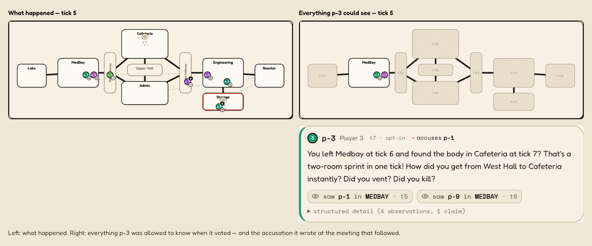

# AiLibi — LLM social deduction behind an observation firewall, built by directing AI coding agents

by **Daniel Keinan** · code by Claude Code agents, reviewed by Codex · [MIT](LICENSE) · [](https://github.com/dkdan10/AiLibi/actions/workflows/ci.yml)  · May–August 2026, solo

**▶ [Live demo](https://dkdan10.github.io/AiLibi/)** — the spectator as a static directory, no server behind it.

[](docs/media/spectator-two-truths.png)

*One tick, two truths. Left: two players are already dead and both impostors are on screen. Right: everything the crewmate p-3 was allowed to know at that same tick — one lit room and one other player. Underneath, what p-3 said at the meeting two ticks later: it accused p-1, who is also a crewmate.*

[](docs/media/spectator-meeting.png)

*One meeting, seed 2: who accused whom, the observations behind each claim, and every ballot beside the sentence its voter acted on.*

[](docs/media/spectator-journey.webm)

*The same game in motion, against the built static bundle: tokens cross rooms, a kill lands, and the transport stops itself when the meeting starts. Click through for the [nine-second clip](docs/media/spectator-journey.webm), which also shows the flip into fog.*

---

## Sixty seconds: what you are looking at

Nine LLM agents walk a room graph, work their task lists, witness what they can see, and meet to argue about it. Two are impostors, told each other's names at the start; the other seven reason in the dark. The spectator opens any agent's mind at any tick — prompt, response, memory, beliefs — and every game replays from an action log and a per-tick hash, byte for byte. (*AiLibi*: an alibi, with the AI in front.)

## At a glance

- **Stack** — Python 3.11 · FastAPI · Pydantic · React + Vite + PixiJS · uv · `mypy --strict` · Hypothesis.
- **Scale** — a snapshot of `main` as of 2026-08-19: 903 commits · 364 merged pull requests · 363 generated agent prompts · 100 committed replays · 4,940 tests in the default gate.
- **Status** — active; phases 0–19 closed, the last on 2026-08-18; phase 20 open.

## Verify it yourself in one minute

Three commands, three claims, all free and offline.

```bash
bash scripts/setup_env.sh   # one-time: uv sync + npm ci

# 1. Proves determinism — the same seed twice, byte-identical replay JSONL.
#    (A fresh dir each time: the recorder refuses to overwrite a replay path.
#    Each run also leaves r1.audit.jsonl / r2.audit.jsonl beside its replay —
#    the log of what each agent was allowed to see, explained in
#    docs/deployment.md under "The audit sidecar beside a replay".)
d=$(mktemp -d)
uv run python scripts/run_game.py --seed 42 --replay-path "$d/r1.jsonl" &&
  uv run python scripts/run_game.py --seed 42 --replay-path "$d/r2.jsonl" &&
  diff -q "$d/r1.jsonl" "$d/r2.jsonl"

# 2. Proves replay integrity — every committed sample still reconstructs through
#    the engine's per-tick state hashes.
bash scripts/verify_samples.sh

# 3. Proves the demo is a static directory — a built bundle with no API process
#    in it, playable from any file server.
uv run python scripts/build_demo_bundle.py && python -m http.server -d frontend/dist/demo-bundle 8080
```

### Three reproducibility scopes

"Reproducible" is three claims here, kept apart rather than traded on the strongest.

1. **Replay integrity** — committed replay bytes reconstruct through the engine's per-tick state hashes. Command 2 above, free and offline. **Verified strong.**
2. **Same-runtime repeatability** — one seed, config, agent factory and set of provider responses produce byte-identical replays on one runtime. Command 1 above, under the fake provider. With a real provider, fresh generation is *not* deterministic: the recording reproduces, the seed does not.
3. **Cross-platform optimizer portability** — independent hosts producing bit-identical learned-optimizer bytes. **Designed for, not yet confirmed.** The sampler uses only operations IEEE-754 requires to be correctly rounded, but has been observed on Linux/x86-64 alone; no caller should rely on it until a run on the recorded failure host reproduces the pinned digest.

## How it was built — who did what

<!-- OWNER: confirm wording — first person, written from git evidence. -->
I'm Daniel Keinan. I built AiLibi solo between May and August 2026 by directing AI coding agents — Claude Code for the code, Codex for review and audit — against written task contracts. I wrote the contracts in `tasks/`, the standing rules in [AGENTS.md](AGENTS.md), the review gates, the audit rulings and the product direction; I did not write production code by hand. The agents wrote every coding pull request and most of the audits. Check that in git instead of taking my word: agent branches are named `claude/…`, agent commits are authored "Claude", and, as of 2026-08-19, 328 commits carry a `Co-Authored-By` trailer naming the model. Two disclosures ride with it: the "independent external audits" here are AI auditors I commissioned, not third parties, and every gameplay and ML number comes from one model on one prompt set, at 50 games per set.
<!-- OWNER: end. -->

Every coding task follows the same five steps:

1. **Author a contract** in `tasks/phase-N.md` — branch, dependencies, files in and out of scope, definition of done.
2. **Generate the prompt** with `uv run python scripts/generate_prompts.py`, which refuses to let a prompt drift from its contract.
3. **Dispatch an agent** against that prompt, in a fresh checkout.
4. **Review the pull request.** CI is required on `main` ([the workflow](.github/workflows/ci.yml)); `bash scripts/check.sh` runs all of it locally except the Playwright browser journey, which CI runs as its own job (`cd frontend && npm run e2e`). I review what a gate cannot judge.
5. **Checkpoint** before high-blast-radius work with a read-only audit.

Here is one of those tasks end to end — what I wrote, what the generator made of it, and what came back.

<!-- EXHIBIT: both excerpts below are byte-checked against their sources by tests/scripts/test_check_doc_facts.py. -->

**1 — the contract I wrote**, from [`tasks/phase-19.md`](tasks/phase-19.md). Two runs of it, verbatim:

```markdown
### Task 19.2 — The in-code truth sweep: docstrings match the bytes
**Branch:** `phase-19-in-code-truth`
**Depends on:** none (root)
…  the section-reference line — a paragraph of anchors into the code — elided here
**Files in scope:**
- agents/memory/beliefs.py; (docstring/comment lines only)
- meetings/transcript.py; (same)
- meetings/manager.py; (same)
- orchestrator/game.py; (the :12-13 module-docstring claim only)

**Files NOT in scope:**
- agents/memory/store.py (the live path is evidence, not an edit target)
- meetings/constants.py; (the resolver homes already state "now always True")
- any resolver body or lever mechanism (behavior untouched)

**Definition of done:**
…  and the checklist, ending in: bash scripts/check.sh passes locally
```

**2 — the prompt the generator produced from it**, [`agent_prompts/task-19-2-in-code-truth.md`](agent_prompts/task-19-2-in-code-truth.md). It carries the contract in verbatim, and `uv run python scripts/generate_prompts.py --check` fails the gate the moment the two disagree:

```markdown
# Agent Prompt — 19.2 The in-code truth sweep: docstrings match the bytes

You are working on AiLibi. Before starting, read AGENTS.md, the architecture routing it names, and the task section in tasks/phase-19.md.
```

**3 — the pull request it produced**: [#328](https://github.com/dkdan10/AiLibi/pull/328), reviewed and merged; on `main` it is the squash commit whose subject ends `(#328)`.
<!-- EXHIBIT-END -->

Rather than take the paragraph above on trust, read the authorship out of git yourself. `git log --author=Claude` on `main` lists what the agents committed and `git log --grep='Co-Authored-By: Claude'` finds the trailer that names the model, but a squashed merge like #328 carries me as its author — the trailer and the model name live on the pull request's own branch commits, not on the squash commit. `git ls-remote --heads origin 'claude/*'` lists the branches those commits arrived on.

## What it is

A deterministic testbed for studying multi-agent reasoning under hidden information, not a game with AI players bolted on. Three decisions carry the weight. The three below restate them in this page's words; the decision record is [ADR-0001](docs/adr/0001-three-load-bearing-decisions.md), which takes them from [DESIGN.md](DESIGN.md) §0 and states two design targets the restatement drops — a 2 Hz tick rate, and no more than 100 LLM calls in a full game.

1. **A deterministic engine behind a strict observation firewall.** The engine advances world state as a pure tick function — no wall clock, no unseeded randomness, no global state — so the same seed and inputs always produce the same bytes. Agents cannot import the engine, directly or transitively: an agent physically cannot read the state it must deduce. It sees an `ObservationPacket` and a `PublicMapView`, and emits an `ActionIntent`. The firewall covers the *agent* surface; the spectator is privileged by design.
2. **Two-tier reasoning.** Movement, tasks and venting are rule-based, every tick. Meeting speech, voting and suspicion updates call an LLM, only at meetings and triggers. Without that split, cost and latency make the system unviable.
3. **Memory is structured first.** Each agent reasons from a typed event log and a belief state derived from it; the LLM sees a rendered view of that structure, never raw engine state.

The system as built: [docs/architecture.md](docs/architecture.md).

[](docs/architecture.md)

*Arrows are data flow; imports run the other way. The barred one is the firewall — `agents/` may not import `engine/`, by an import-linter contract of that name, checked in CI on every pull request and every push to `main`.*

## What the measurements said

Every figure is the current reference recording, made 2026-08-25, with the one it replaced beside it. A row that reads the same in both columns is a row nothing moved.

| What | Figure | [At baseline 6](docs/glossary.md#baseline-n-the-reference-recording) | Recorded on, and where it lives |
|---|---|---|---|
| Committed sample replays that reconstruct byte-identically | 100 of 100 | 100 of 100 | every commit — `scripts/verify_samples.sh` |
| Observation-firewall violations, all phases | zero | zero | never breached in CI: the [import-linter contracts](.importlinter), the planted-leak test in [tests/test_firewall.py](tests/test_firewall.py), the recursive sweep in [eval/leak_scan.py](eval/leak_scan.py) |
| Impostor win rate, committed samples | 36% (4p1i), 24% (9p2i) | 34% (4p1i), 30% (9p2i) | the 2026-08-25 record — [4p1i](replays/samples/4p1i/MANIFEST.md), [9p2i](replays/samples/9p2i/MANIFEST.md) |
| Eject ballots carrying a valid citation, a turn or an observation id (9p2i) | 538 / 538, zero dangling | 520 / 520, zero dangling | reference recording 7, 2026-08-25 — [instrument](tests/eval/test_vj_instruments.py) |
| Ejection accuracy with engine-certified proof of the ejectee's role, against without | 326 / 326 = 1.0000 vs 61 / 103 = 0.5922 | 310 / 310 = 1.0000 vs 46 / 125 = 0.3680 | the 2026-08-25 record, pooled over four recorded sets — [the record](audits/audit-phase-20-baseline-7.md) §3, against [phase-19 close](audits/audit-phase-19-close.md) §4.1; 42 of 42 innocent ejections sit in the no-proof cell |
| Correct 9p ejections riding an ejectee-specific vent sighting | 69 / 85 = 81% | 68 / 78 = 87% | reference recording 7, 2026-08-25 — the cross-tab in the [reading guide](docs/reading-guide.md). Reading: general social deduction, **not** demonstrated |
| Learned tactical policies that became the default | none, ruled twice | none, ruled twice | 2026-07-18 and 2026-08-01 — [phase 17](audits/audit-phase-17-close.md), [phase 18](audits/audit-phase-18-close.md) |

*Valid* in the citation row means resolvable, not supported: each of those 538 ballots points at a transcript turn or an observation its voter really held, and nothing checks that the cited line bears out the accusation built on it.

**The headline finding is a negative one, and that is the point.** Four in five of the crew's correct 9-player ejections — 69 of 85 — ride an engine-certified vent sighting. Take that proof away and the table is close to a coin flip: of the 30 ejections it reaches without one, 16 land on an impostor and 14 convict a crewmate. So the corpus demonstrates LLM evidence-processing of certified facts, plus real deception on top — and *not* general social deduction. The cross-tab is in the [reading guide](docs/reading-guide.md).

**Two of the bars were written down first, and both were missed.** Before any of the evidence repairs existed, this phase registered in writing what the next recording would have to show. Measured on it: conviction accuracy without engine-certified proof came to 61 of 103 = 0.5922 against a registered bar of 0.60 — short by 0.0078, less than a single ejection — and wrongful ejections came to 42 against a bar of fewer than 35. Under the rule as written that is a **finding, not an adoption**. I then adopted this recording as the reference anyway, by an explicit owner override of that verdict, whose grounds and date are in [the record](audits/audit-phase-20-baseline-7.md) §6.1 (2026-08-26). The bars did not pass; the miss stays on this page. The win split, which a reader reaches for first, moved nothing it can be read through: every leg landed inside the ±15-point band registered for it, and a second repair rode the same recording, so nothing about the game's balance is attributable to any one of them.

**Four learned impostor policies beat the scripted one on wins; none became the default.** Two phases of evolutionary search over the impostor's tactical decisions produced policies that won more games than the same-seed scripted comparator, and every one of them failed an evidence-quality gate written down *before* the measurement that judged it — so both phases closed having adopted nothing. Two qualifications ride with that result, and they cut against it: the edge of the one learned policy this repo committed is not statistically significant at 50 games, and the scripted comparator those runs were measured against carried two measured target-selection defects that depress it, so each edge is an upper bound. Both defects are repaired now and nothing was retrained, so those edges were never re-measured and are stale by construction. The whole account in research shape — problem, environment, method, results, limitations — is [the ML program page](docs/ml-program.md).

## What I learned

Eight claims I would not have made in May, in one page: [docs/lessons.md](docs/lessons.md).

- A written contract — files in scope, files out of scope, a definition of done ending in a command — is the unit of work when the implementer is an agent; a conversation is not.
- Re-reading every file and line a contract cites *before* dispatching it prevents more wasted agent-hours than any improvement to the prompt wording.
- A green build and a broken game are not a contradiction: the tests defend correctness against a specification, and nobody tests the specification.
- The three defects my gates structurally could not see were an invariant that a later configuration change quietly falsified, a check that validated shape instead of entitlement, and architecture contracts that covered a quarter of the tree — all three now closed.
- A gate only ever sees the axis it was pointed at, so the answer to a gate that missed something is a different axis, not more of the same one.
- Documentation drift is a defect with a test, not untidiness with a chore: the result figures on this page are recomputed from the bytes that own them wherever a source can be counted, held against the second table that states them where one cannot, and every count that ages without an edit — commits, merged pull requests, tests — has to carry the date it was taken.
- A bar written down before the measurement is worth nothing until it is allowed to say no in public — two of mine did, and the miss is [in the section above](#what-the-measurements-said).
- The sharpest review of this project was not a defect report but a line about judgment, and quoting a critic verbatim on your own front page is a stronger claim than any number in the table above.

The review those lessons came out of is published in full — curated, indexed, and titled by the four of its own headline claims it disproved: [the 2026-08-19 three-track review](audits/review-2026-08-19/README.md).

## Project status

Active. Phases 0–5 built the MVP; phases 6–19 pushed how well the agents reason, moved the eval onto a hosted model, and ran a four-phase ML program. Phase 20 — evidence honesty — closed 2026-08-26: its repairs shipped, its one pre-registered recording was spent, the rule returned a finding, and I adopted the new reference recording over that finding by explicit override. The whole close, including the defects it found in the tree it was closing, is in [audits/audit-phase-20-close.md](audits/audit-phase-20-close.md).

Four learned tactical policies each beat the scripted one on wins. None became the default, because each failed an evidence-quality bar I had written down *before* the measurement that judged it — so both of those phases closed having adopted nothing and moved no reference recording. That is what those two closes mean: the bar was pre-registered, the honest answer was "not yet", and I record the miss rather than move it. The current reference recording is the seventh, which the audits call [baseline 7](docs/glossary.md#baseline-n-the-reference-recording).

Close audits start at the MVP close and resume at phase 13; earlier rows link the contract. One paragraph per phase: [docs/history.md](docs/history.md).

| Phase | What it did | Record |
|---|---|---|
| 0 | Scaffolding, CI, the firewall lint rule, the first ADR | [contract](tasks/phase-0.md) |
| 1 | Engine: state, rules, seeded RNG, visibility, replay, leak test | [contract](tasks/phase-1.md) |
| 2 | Tactical agents: memory, perception, pathfinding, headless runs | [contract](tasks/phase-2.md) |
| 3 | LLM-driven meetings, voting, contradiction detection | [contract](tasks/phase-3.md) |
| 4 | The spectator UI, replay-only | [contract](tasks/phase-4.md) |
| 5 | Eval metrics, dashboard, prompt-regression gate — the MVP | [audit](audits/audit-2026-05-30-0059-mvp-close.md) |
| 6 | Post-MVP repair and hardening | [contract](tasks/phase-6.md) |
| 7 | Impostor coordination; the eval moved to a local model | [contract](tasks/phase-7.md), [plan](tasks/phase-7-plan.md) |
| 8 | Deduction-substrate restructure | [contract](tasks/phase-8.md) |
| 9 | Producer hygiene and conversion quality | [contract](tasks/phase-9.md) |
| 10 | Conviction-engine repair; the crew's evidence economy | [contract](tasks/phase-10.md) |
| 11 | The impostor's information economy: vents, sabotage, balance | [contract](tasks/phase-11.md) |
| 12 | Front-end rework: the replay viewer as a product | [contract](tasks/phase-12.md) |
| 13 | Pre-ML grounding: rubric repair and deduction rework | [audit](audits/audit-2026-06-25-0859-phase-13-close.md) |
| 13.5 | Memory correctness, down to the substrate | [contract](tasks/phase-13-5.md) |
| 14 | A hosted provider, and the model/prompt migration onto it | [audit](audits/audit-phase-14-close.md) |
| 15 | Evidence cleanup, then the training environment | [audit](audits/audit-phase-15-close.md) |
| 16 | Voice and judgment: citation-gated ballots, pooling, personas | [audit](audits/audit-phase-16-close.md) |
| 17 | Co-adaptation: corpus and learned policies re-run together | [audit](audits/audit-phase-17-close.md) |
| 18 | The ML phase: co-evolution, the finalist eval, no adoption | [audit](audits/audit-phase-18-close.md) |
| 19 | Review and refresh: truth sweeps, spectator pass, ML close | [audit](audits/audit-phase-19-close.md) |
| 20 | Evidence honesty: claims repaired, the inference channel rebuilt, one pre-registered recording | [audit](audits/audit-phase-20-close.md) |

## Run it

```bash
bash scripts/setup_env.sh   # uv sync + npm ci; Python 3.11 and Node are both required
bash scripts/check.sh       # the full local gate: lint, types, imports, tests, frontend build
bash scripts/run_spectator.sh                       # API + UI on http://localhost:5173
uv run python scripts/run_tournament.py --num-games 50 --output-dir replays --roster-preset 4p1i
```

The spectator API is an unauthenticated game-master view, so it is loopback-only and stays that way; the static bundle is the only sanctioned public artifact ([docs/deployment.md](docs/deployment.md)).

**Providers.** `AILIBI_LLM_PROVIDER` selects one: `fake` (the default — deterministic, offline, $0, what CI runs), `anthropic`, `ollama` for a local open model, or `featherless` for the hosted model every recorded number came from. CI never selects a real provider.

**The fake provider's report is empty on purpose.** Every fake ballot's vote target is a minted placeholder that the meeting layer normalizes to SKIP, so a fake tournament ejects nobody and its rates come out null. A real one is committed: [replays/samples/9p2i/tournament-eval-report.json](replays/samples/9p2i/tournament-eval-report.json) records 99 ejections, vote correctness 0.918, ejection accuracy 0.859.

**The samples.** A fresh clone ships 100 sample replays under `replays/samples/`: two 50-game tournaments, one per roster preset (`4p1i` and `9p2i`), regenerated 2026-08-25 against `Qwen/Qwen3.6-27B` on the `qwen3_6_27b` `v4` prompt set, impostor win rates 36% (4p1i) and 24% (9p2i). Each set's `MANIFEST.md` is the row-by-row provenance record. Replays you generate into `replays/` override the bundled ones.

**Cloning.** `git clone --filter=blob:none https://github.com/dkdan10/AiLibi.git` is the fast path — roughly the 256 MiB the working tree needs, not every blob version. A full clone still pays for the committed evidence; [docs/artifacts.md](docs/artifacts.md) has the retention rules and the restore script.

---

**Where to go next.** [Architecture](docs/architecture.md) · [Reading guide](docs/reading-guide.md) · [Glossary](docs/glossary.md) · [History](docs/history.md) · [Audits index](audits/README.md) · [Workflow protocol](AGENTS.md) · [Contributing](CONTRIBUTING.md) · [Design history](DESIGN.md) · [Build plan](AGENT_IMPLEMENTATION.md).
