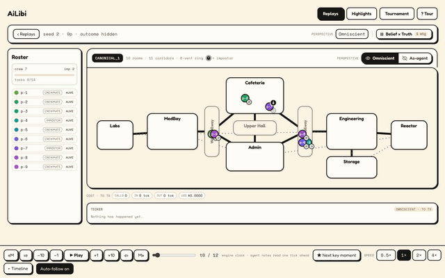
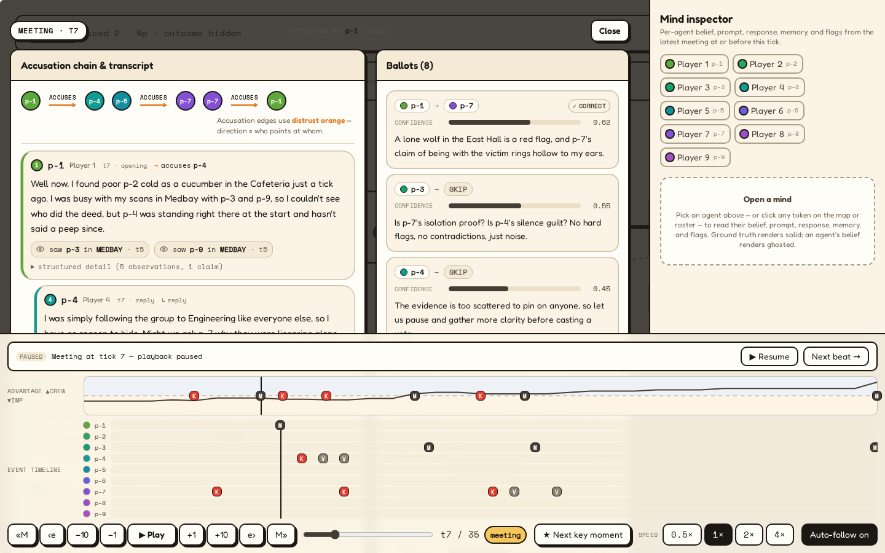

# AiLibi

> An Among-Us-style social-deduction simulator being built almost entirely by AI coding agents under a strict review protocol — and a working example of how to keep architecture coherent across many agent-authored pull requests.



*15 seconds, no cuts: open the hand-picked featured game → play → the transport **stops itself** when a meeting starts (a whole deliberation happens inside one tick) → read the ballots → the ending, which stays hidden until you ask for it. Recorded against the shippable static bundle, so what you are watching is the artifact, not a dev server.*

[](docs/media/spectator-meeting.png)

*Inside one meeting (seed 2, tick 7). Left: the reactive accusation chain — p-1 accuses p-4, the accused answers next — with each claim's structured observations underneath it. Right: the ballots, each with its confidence and the sentence the agent voted on. Right rail: any agent's memory and beliefs at that moment. The two impostors at this table know each other — they are told at game start; the seven crewmates are the ones reasoning in the dark, and the spectator sees all of it.*

### Reproduce the three claims above

```bash
bash scripts/setup_env.sh   # one-time: uv sync + npm ci

# 1. Determinism — the same seed twice, byte-identical replay JSONL.
#    (A fresh dir each time: the recorder refuses to overwrite a replay path,
#    deliberately — re-using one silently doubled per-seed files in Phase 4.)
d=$(mktemp -d)
uv run python scripts/run_game.py --seed 42 --replay-path "$d/r1.jsonl" &&
  uv run python scripts/run_game.py --seed 42 --replay-path "$d/r2.jsonl" &&
  diff -q "$d/r1.jsonl" "$d/r2.jsonl"

# 2. Replay integrity — every committed sample still reconstructs through the
#    engine's per-tick state hashes. Free, offline, no API key.
bash scripts/verify_samples.sh

# 3. The spectator above, on the 100 committed replays (opens localhost:5173).
bash scripts/run_spectator.sh
```

Or build the demo you just watched — a static directory with no API process in
it, playable from any file server:
`uv run python scripts/build_demo_bundle.py && python -m http.server -d frontend/dist/demo-bundle 8080`
([docs/deployment.md](docs/deployment.md)).

---

## What this is

AiLibi is two things at once.

**A deterministic multi-agent reasoning testbed.** Players (agents) roam a room graph, complete their own tasks, witness events, and meet to deliberate over a reactive accusation chain. One or more impostors are hidden among them (the default game is 4 players / 1 impostor; a 9-player / 2-impostor preset also ships). The product is a research environment for studying agent reasoning under hidden information — not a game with AI players bolted on. See [docs/architecture.md](docs/architecture.md) for the system as built.

**An experiment in agentic software workflow.** Every coding PR was opened by an AI coding agent against a task contract authored by a human. Architecture is enforced by tooling — import-linter, `mypy --strict`, a recursive observation leak test, byte-identical replay determinism. The contracts in `tasks/phase-N.md` are the only spec each agent sees. So far: 300+ merged agent-authored PRs — the live count is on GitHub, deliberately not re-pinned here — every one of them merged green through the same full gate, and zero observation-firewall violations. Phases 0–5 delivered the MVP; the phases after that pushed agent-reasoning quality and migrated the eval model.

**New here?** [docs/reading-guide.md](docs/reading-guide.md) is the outsider's five minutes: the verified numbers with the committed path that owns each one, which replays to watch and why, what the corpus does and does not demonstrate, a glossary for the audit idiom, and the three audits worth reading first.

---

## How this is being built

The workflow is the experiment. Every coding task follows the same loop:

1. **Author a task contract** in `tasks/phase-N.md` — branch, dependencies, files in/out of scope, definition of done, implementation hint.
2. **Generate a paste-ready prompt** with `uv run python scripts/generate_prompts.py`. The generator validates that every prompt mirrors its contract byte-for-byte and that parallel tasks don't share file scope.
3. **Dispatch an agent** (Claude Code, web or CLI) against the prompt. The agent works in a fresh checkout, runs `bash scripts/check.sh` until green, and opens a PR against [.github/pull_request_template.md](.github/pull_request_template.md).
4. **Review the PR.** CI gates catch the easy stuff (lint, types, firewall, determinism); the human catches the rest.
5. **Checkpoint periodically.** Before high-blast-radius work, a read-only checkpoint re-verifies prior findings and surfaces drift CI can't catch.

Two representative artifacts to skim:

- A task contract — [tasks/phase-3.md](tasks/phase-3.md) Task 3.19 (robust JSON extraction + failure recording) shows the ~300-line full-contract shape.
- Its auto-generated prompt — [agent_prompts/task-3-19-robust-json-extraction-and-failure-recording.md](agent_prompts/task-3-19-robust-json-extraction-and-failure-recording.md).

---

## Three load-bearing decisions

These are the architectural invariants every contributor (human or agent) must respect. They are recorded verbatim in [ADR-0001](docs/adr/0001-three-load-bearing-decisions.md).

**1. Tick-based deterministic engine with a strict observation firewall.** The engine advances world state as a pure, deterministic tick function — the same seed and inputs always produce bit-exact replays (no wall-clock, no unseeded randomness, no global state), verified by property tests and scripted-game determinism tests. Agents never touch engine state: `agents/` cannot import `engine/`, directly or transitively (import-linter enforced, tested with direct- and transitive-leak fixtures). Agents see only `ObservationPacket` and `PublicMapView` and emit only `ActionIntent`; the leak test walks every emitted packet recursively and rejects any hidden field (role, killer identity, kill attribution). The firewall is scoped to the *agent* surface — the spectator surfaces (replay viewer, eval dashboard) are privileged by design and intentionally expose role + kill attribution.

**2. Two-tier agent reasoning.** Tactical decisions (move, do task, follow, vent) are rule-based and run every tick. Strategic decisions (meeting reports, voting, suspicion updates) use an LLM (added in Phase 3) and run only at meetings or specific triggers (witnessing a kill, finding a body). Without this split, cost and latency make the system unviable.

**3. Memory is structured first.** Each agent reasons from a typed event log and a derived belief state (suspicion, trust, alibi). The LLM sees a *rendered view* of that structure during meetings — never raw engine state.

---

## Project status

MVP (phases 0–5) is complete. Everything since has pushed agent-reasoning quality on the same substrate. Phases 0–18 are merged and closed (Phase 18 — the ML phase — closed 2026-08-01 with no mover flip: every learned arm keeps a real win edge over the same-seed scripted FSM (+0.12 to +0.30) yet fails the baseline-6 conviction-economy referee, so the scripted FSM stays the default mover, the learned champion stays opt-in, and baseline 6 (the 18.12 meeting-layer adopting record) stands as the ladder tip; [audits/audit-phase-18-close.md](audits/audit-phase-18-close.md)); Phase 19 ([tasks/phase-19.md](tasks/phase-19.md)) — review-and-refresh — is under way.

The table covers the arc through Phase 14; the paragraph below it carries phases 15–19.

| Phase | Description |
| --- | --- |
| 0 | Scaffolding, CI, firewall lint, ADR |
| 1 | Engine: state, rules, RNG, visibility, replay, leak test |
| 2 | Tactical agents: memory, perception, A*, FSMs, headless orchestrator + tournament harness |
| 3 | LLM-driven meetings, voting, contradiction detection |
| 4 | Spectator UI (FastAPI + React + PixiJS), replay-only |
| 5 | Eval metrics + tournament dashboard + prompt-regression close gate — **MVP complete** |
| 6 | Post-MVP repair & hardening |
| 7 | Agent intelligence: impostor coordination + local-Ollama eval pivot |
| 8 | Deduction-substrate restructure |
| 9 | Producer hygiene + conversion quality |
| 10 | Conviction-engine repair + crew evidence economy + impostor gameplay |
| 11 | Impostor information economy (vents, sabotage, then balance) |
| 12 | Front-end rework (spectator replay viewer, "Playful" cream/ink design) |
| 13 | Pre-ML grounding fixes: rubric repair + deduction rework |
| 13.5 | Memory-substrate correctness (truth-up → substrate) |
| 14 | Featherless AI integration: hosted-provider + model/prompt migration |

The post-Phase-14 roadmap is laid out in [tasks/post-phase-14-plan.md](tasks/post-phase-14-plan.md): Phase 15 ([tasks/phase-15.md](tasks/phase-15.md)) runs an evidence-substrate cleanup wave (charter: [tasks/post-phase-14-clean-up.md](tasks/post-phase-14-clean-up.md)) closing on baseline 3, then the machine-learned tactical-policy program — measurement harness, training environment, calibration corpus, rebuilt meeting surrogate, and a multi-method training bake-off — with a mid-phase pause that picks the winning method on measured numbers before a productization wave is authored. Phase 15 closed 2026-07-11 (branch A: the learned impostor champion ships opt-in; baseline 3 canonical at that close). Phase 16 ([tasks/phase-16.md](tasks/phase-16.md)) closed 2026-07-14 on baseline 5: Voice & Judgment — citation-gated ballots (graduated ON with the hard-evidence gate and observation-id rendering; citation compliance 1.000 at close), information pooling (roll-call/vouching shipped; the absence prior stayed OFF at that close as a recorded slate ruling pending roll-call calibration — it later graduated ON at the baseline-6 record), personas — all on the probe-locked `Qwen/Qwen3.6-27B` (baseline 4 was the model-only swap). Phase 17 ([tasks/phase-17.md](tasks/phase-17.md)) closed 2026-07-18: co-adaptation — the ML corpus re-recorded at baseline 5 (restoring it as the canonical canary denominator), the ballot surrogate re-fit (first GO verdict, training-time-runner tier), and the full impostor/crew slate re-run and re-selected under the baseline-5 referee — with the evidence-gated default flip ruled FAIL (`utility-es` keeps a +0.16 win edge over the scripted FSM but fails the conversion-economy floors; `policy-es` passes the referee at a 0.02 win rate), so the scripted FSM stays the default mover, the learned champion stays opt-in, and no baseline 6 is recorded ([audits/audit-phase-17-close.md](audits/audit-phase-17-close.md)). Phase 18 ([tasks/phase-18.md](tasks/phase-18.md)) closed 2026-08-01: the ML phase (owner re-charter — presentation deferred; Phase 19 re-chartered as review-and-refresh) — the meeting-layer package graduated CREW-ONLY at the baseline-6 adopting record with the ML corpus re-recorded on it (restoring the canonical canary denominator at the new substrate), the conviction-economy model landed GO (conversion-label accuracy 0.938 — 90/96 on its own conversion labels, never a property of the composed runner) and composed with the surrogate's retained ranking channel into the meeting-outcome runner for training rollouts (whose decision accuracy is 83/96 = 0.8646 against the 0.625 always-eject constant), alternating-freeze co-evolution ran the impostor campaign (STOPPED, screening-tier shortlist) then the crew campaign, and the real-LLM finalist eval fed the two-axis owner ruling: NO-FLIP (every learned arm beats the same-seed FSM comparator on wins, +0.12 to +0.30, and every arm fails the baseline-6 supply/conversion referee — the Phase-17 starved-economy shape reproduced on a co-adapted slate), zero of the fourteen pre-registered emergence rulings demonstrated (the two selected-for kill-placement cells recorded as named findings N1/N2), and no crew adoption ([audits/audit-phase-18-close.md](audits/audit-phase-18-close.md)). Phase 19 ([tasks/phase-19.md](tasks/phase-19.md)) — review-and-refresh, chartered 2026-08-03 — is the phase now under way.

---

## Reproduce a game

The single strongest demonstration of the determinism claim is that anyone can run the same seed twice and get byte-identical replays.

```bash
bash scripts/setup_env.sh

d=$(mktemp -d)   # the recorder refuses to overwrite an existing replay path
uv run python scripts/run_game.py --seed 42 --replay-path "$d/r1.jsonl"
uv run python scripts/run_game.py --seed 42 --replay-path "$d/r2.jsonl"

diff -q "$d/r1.jsonl" "$d/r2.jsonl"   # files are identical
```

The replay JSONL records per-tick actions and a SHA-256 hash of the full engine state. Identical seed + identical config + identical agent factory always produces identical bytes under the deterministic fake provider (the default, and what the demo above runs); with a real provider, fresh generation is non-deterministic and it is the *recording* that reproduces byte-identically — the scopes below state the exact claims. The fake-provider property is also how CI proves the engine is pure: `eval/determinism_test.py` runs every scripted fixture twice and compares the entire JSONL output.

### Three reproducibility scopes

"Reproducible" is three different claims here, and the repo keeps them apart rather than trading on the strongest one:

1. **Replay integrity** — committed replay bytes reconstruct through the current engine's per-tick state hashes. Free and API-less: `bash scripts/verify_samples.sh` replays every bundled sample and fails loud the moment a recorded hash no longer reconstructs. Verified strong.
2. **Same-runtime repeatability** — the same seed, config, agent factory and provider responses produce byte-identical replays on the same runtime. That is the run-twice demo above, verified with the fake provider; the ES optimizer's stream is pinned the same way, as a fixed digest in `tests/training/test_es.py`.
3. **Cross-platform optimizer portability** — independent hosts producing bit-identical learned-optimizer bytes. This one is **designed for, not yet confirmed**. The sampler in `training/bakeoff/es.py` is built only out of operations IEEE-754 requires to be correctly rounded, but it has only been observed on Linux/x86-64; until an owner-assisted Darwin-arm64 run (the recorded failure host) reproduces the pinned digest, cross-platform portability is a design property of that module, not a supported guarantee, and no caller should rely on it (Task 19.3).

---

## Watch a replay

The spectator UI reads saved replay JSONL files and renders the game tick by tick — map, agents moving room to room, meeting transcripts, contradiction flags, per-agent memory snapshots, and a suspicion heatmap.

```bash
bash scripts/run_spectator.sh
```

That starts the API + frontend, waits until both are healthy, and opens `http://localhost:5173` in your browser. Ctrl-C stops both. (One-time prerequisite: `bash scripts/setup_env.sh`. macOS + Linux only.)

The spectator API is an unauthenticated game-master view — roles, kill attribution, vent state — so it is loopback-only and stays that way. To *share* the viewer instead, build the static demo bundle: `uv run python scripts/build_demo_bundle.py` writes one directory (the built frontend plus pre-baked JSON for the featured replays only) that plays with no API process at all, from any static file server. That bundle is the only sanctioned public artifact; the trust boundary and what the bundle does and does not carry are in [docs/deployment.md](docs/deployment.md).

A fresh clone ships with 100 sample replays under `replays/samples/` — two full 50-game tournaments, one per roster preset (`4p1i/` and `9p2i/`), regenerated 2026-07-20 against the Featherless provider (`Qwen/Qwen3.6-27B` — the Task-16.2 locked model, non-thinking — on the `qwen3_6_27b` `v3` prompt set, model and prompt registry both unmoved at this record). They are the Task-18.12 adopting record for baseline 6: the meeting layer graduated **CREW-ONLY** — the roll-call round, the endpoint-band whereabouts exemption, the vent-placement contradiction variant (flag-minting plus the absent-set widening), and the absence prior all made unconditional beside the nine levers already retired, while the impostor-answer arm (`impostor_roll_call`) did not ship, so the record was made in a bare environment with that toggle OFF ([audits/audit-phase-18-baseline-6.md](audits/audit-phase-18-baseline-6.md)). Each set's `MANIFEST.md` is the canonical provenance record — its `flags` column stamps all 13 graduated levers on every row; the recorded impostor win rates are 34% (4p1i) and 30% (9p2i). These sets are the ladder tip: baseline 6 is where the substrate stands, and Phase 19 does not move it. Once the UI is up, pick a roster set and any replay to scrub through ticks, click meeting markers to read transcripts with ballots and contradiction flags, and select an agent to see their memory snapshot and the suspicion heatmap at that moment. Any replays you generate locally into `replays/` (e.g. via `scripts/run_game.py`) override the bundled samples; the API logs which directory it picked at startup.

Those samples are managed by a refresh workflow. `scripts/refresh_samples.sh` regenerates them against the active provider — `--full` (all 50 seeds), `--meetings` (only the meeting-bearing seeds), or `--seeds N,N,N` (a subset) — recording each sample's prompt-template versions, model, spend, and outcome in the set's `MANIFEST.md` so metrics can be attributed to a specific prompt version + model snapshot. Its free, API-free counterpart `scripts/verify_samples.sh` replays every sample through the engine and fails loud if any recorded state-hash no longer reconstructs, catching determinism drift before a metric reads a stale sample.

The spectator surface is the Phase-12 "Playful" rework, not a debug view: PixiJS map playback with a fog-of-war perspective toggle (omniscient, or ghosted to what one agent could see), meeting transcripts with ballots and contradiction flags, per-agent `MindInspector` memory snapshots, a `BeliefMatrix` suspicion heatmap, a `ThoughtStream`, a `GuidedTour`, and keyboard-driven `ReplayControls`. Alongside the per-game replay viewer, a **Tournament Dashboard** tab renders the aggregate eval report for a whole tournament run (see "Run a tournament" below). The spectator API exposes sanitized DTOs (`api/schemas.py`) covering everything visible: agent positions per tick, meeting transcripts with ballots and contradiction flags, per-agent memory snapshots at meeting boundaries, and the full LLM call log with prompts, responses, and cost.

---

## Run a tournament & read the metrics

Phase 5 turns the engine into an eval harness. One command runs N games, saves each game's replay, and writes the aggregate eval report — all into one directory:

```bash
uv run python scripts/run_tournament.py --num-games 50 --output-dir replays --roster-preset 4p1i
```

This writes per-seed `replay-seed-*.jsonl` files plus a `tournament-eval-report.json` to `--output-dir`. `--roster-preset {4p1i,9p2i}` selects a named roster (or pass `--num-players` / `--num-impostors` explicitly). With the default fake provider it costs $0 and runs offline (useful for the CI loop); set a real provider (below) for metric values that reflect real model behavior.

### Providers

The provider is selected by `AILIBI_LLM_PROVIDER`:

- **`fake`** (default) — deterministic, offline, $0. Powers the CI loop.
- **`anthropic`** — the real Anthropic provider (requires `ANTHROPIC_API_KEY`).
- **`ollama`** — a local open model (`qwen3.5:9b`), free, served from your own machine.
- **`featherless`** — hosted Featherless AI (`Qwen/Qwen3.6-27B`), OpenAI-compatible, on a flat-rate subscription (recorded as $0; requires `FEATHERLESS_API_KEY`). This is the **canonical eval provider** as of Phase 14 (model locked 2026-07-12, Task 16.2 — audits/audit-phase-16-model-lock.md).

Both open-model providers disable "thinking" per request and fail loud if a response still carries thinking content. CI never selects a real provider and never reaches the network; the live integration tests are opt-in.

```bash
# Example: local Ollama
ollama pull qwen3.5:9b
ollama serve                          # serves http://localhost:11434
export AILIBI_LLM_PROVIDER=ollama
uv run python scripts/run_tournament.py --num-games 50 --output-dir replays

# Example: hosted Featherless
export AILIBI_LLM_PROVIDER=featherless FEATHERLESS_API_KEY=...
uv run python scripts/run_tournament.py --num-games 50 --output-dir replays
```

Per-call model ids default to the active provider's model and can be overridden with `AILIBI_LLM_MEETING_MODEL` / `AILIBI_LLM_TRIGGER_MODEL`.

The report is consumed by pure analyzers in `eval/` — each reads the typed `TournamentReport`, never raw JSONL:

- **vote correctness** — were ejections evidence-backed, or coin-flips? (guards against circular "they were the impostor so the vote was right" scoring).
- **accusation calibration** — does stated confidence match how often an accusation is correct? (reliability curve + ECE).
- **alibi fabrication** — how often does an impostor's alibi claim survive scrutiny.
- **cost dashboard** — total/mean spend, a per-model roll-up, and a per-prompt-version cost breakdown so a prompt change's cost impact is legible alongside its quality impact.

The **Tournament Dashboard** tab in the spectator UI renders this report (served via `GET /eval/tournament-report`).

### The close gate: prompt change → measurable metric delta

The acceptance gate is a deterministic regression loop, not a live eval: change a prompt template and a metric must move, attributably. `tests/eval/test_prompt_regression.py` demonstrates it from frozen recorded fixtures (no model, no network) — bumping the impostor-report template moves the alibi-fabrication survival rate, attributed to that specific `(template_name, version)` via per-version provenance. Because it runs on committed fixtures, the whole prompt-iteration loop is reproducible in CI.

---

## Setup

```bash
# clone — the fast path (see the caveat below)
git clone --filter=blob:none https://github.com/dkdan10/AiLibi.git && cd AiLibi

# install
bash scripts/setup_env.sh

# full local gate: ruff check, ruff format --check, lint-imports, validate_task_docs,
# generate_prompts --check, mypy (strict, via config), pytest, + frontend tsc + build
bash scripts/check.sh

# run a single deterministic game (a path that does not exist yet — the
# recorder refuses to overwrite one, so re-runs need a fresh --replay-path)
uv run python scripts/run_game.py --seed 0 --replay-path "$(mktemp -d)/replay.jsonl"

# run a tournament: replays + aggregate eval report into one dir
uv run python scripts/run_tournament.py --num-games 50 --output-dir replays
```

Python 3.11 only. The [`uv`](https://docs.astral.sh/uv/) package manager is required. Node.js + npm are required too: `setup_env.sh` runs `npm ci` in `frontend/` whenever `frontend/package.json` is present (it is), `check.sh` ends on the frontend `tsc:check` + `build` legs, and `run_spectator.sh` serves the Vite frontend.

**`--filter=blob:none` is the fast path, and here is the honest caveat.** A blobless partial clone fetches file contents on demand, so you download roughly the 256 MiB the working tree needs instead of every version of every blob in the history — which matters here because the repo carries committed evidence (100 sample replays, the ML corpus, the co-evolution measurement record). Task 19.22 moved the Phase-18 co-evolution bytes no test reads onto a pinned evidence commit and shrank the working tree by 101 MiB, but it **rewrote no history**: a plain full clone still pays for those bytes, and will until someone deliberately rewrites history — a `filter-repo` pass and a force-push that invalidates every existing clone and every commit sha cited in the audits. That is not scheduled. [docs/artifacts.md](docs/artifacts.md) has the retention rules and `scripts/fetch_evidence.sh` restores the moved bytes by their pinned sha.

---

## Architecture notes

- `engine/` — pure simulation. No LLM, no I/O, no globals. Owns hidden state.
- `observation/` — the firewall. Builds `ObservationPacket` and `PublicMapView` from engine state, strips every hidden field, audits every packet to disk.
- `agents/` — tactical (deterministic FSMs) and strategic (LLM-driven meeting reasoning) policies. No engine imports.
- `meetings/` — the meeting protocol: an opening turn → a reactive accusation chain → opt-in info-share → voting, with contradiction detection. No engine imports.
- `llm/` — provider-neutral `LLMClient` Protocol; Anthropic, local-Ollama, and Featherless adapters; budget enforcement; a fake deterministic provider for CI.
- `orchestrator/` — wires everything: seeds initial state, dispatches agents, translates `ActionIntent` → engine `Action`, runs meetings, records replay JSONL.
- `eval/` — the eval harness: the typed tournament report schema, the metric analyzers (vote correctness, accusation calibration, alibi fabrication, cost dashboard, and more), the JSONL→`TournamentReport` loader (roles taken from authoritative final engine state, never the replay), the tournament runner, the determinism + leak tests, and the prompt-regression close gate.
- `api/` — FastAPI app + sanitized DTO inventory + replay loader + the tournament eval report endpoint. The spectator surface; intentionally privileged.
- `frontend/` — React + Vite + Tailwind + PixiJS spectator UI (the Phase 12 "Playful" cream/ink rework): MapView, MeetingView, MindInspector, BeliefMatrix, ThoughtStream, ReplayControls, TournamentDashboard, and more. Consumes the API DTOs; never imports Python.
- `tasks/` — the project's spec, decomposed into task contracts.
- `agent_prompts/` — paste-ready prompts auto-generated from the task contracts.

Outsider reading guide (the meta-story, the numbers, the audit-idiom glossary): [docs/reading-guide.md](docs/reading-guide.md). Current architecture: [docs/architecture.md](docs/architecture.md). Workflow protocol: [AGENTS.md](AGENTS.md). Historical design record (rationale and history, not current architecture): [DESIGN.md](DESIGN.md). Build plan: [AGENT_IMPLEMENTATION.md](AGENT_IMPLEMENTATION.md).
