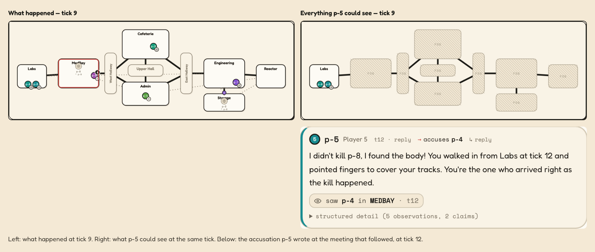

# AiLibi — can agents reason from what they actually saw?

by **Daniel Keinan** · implemented by Claude Code and Codex agents · AI-reviewed · [MIT](LICENSE) · [](https://github.com/dkdan10/AiLibi/actions/workflows/ci.yml)

**[Watch the recorded demo](https://dkdan10.github.io/AiLibi/)** · [Inspect results and decisions](https://dkdan10.github.io/AiLibi/?set=9p2i&view=tournament) · [Read an ownership decision](docs/ownership-case-study.md)

AiLibi is a reproducible social-deduction simulation and spectator. Seven crewmates complete tasks while two impostors kill, deceive, and sabotage. Players move along room edges and observe only their surroundings. Reporting a body or calling an emergency meeting starts structured discussion and voting. Crew win by finishing tasks or ejecting every impostor; impostors win through parity or unresolved sabotage.

The interesting question is whether a plausible accusation follows from the evidence. Open a ballot's statement or observation citation, check its exact source, inspect the corresponding scene, and return to the meeting. A resolvable citation can be irrelevant; a real sighting can support an invalid inference.

[](https://dkdan10.github.io/AiLibi/)

*9p2i seed 19, the game the demo's guided tour opens on, from the 2026-10-09 record (9p2i): at tick 9 two players lie dead, one impostor stands in MedBay and the other is inside a vent, while p-5 can see only p-4, whom p-5 accuses at the meeting that follows. [Media provenance](docs/media/README.md#provenance) records the source and asset identities; the [short clip](docs/media/spectator-journey.webm) walks the same game.*

## What the measurements said

The shown 9-player set was recorded 2026-10-09 under the adopted gameplay changes, in [its own era](docs/glossary.md#era-recordings-that-share-one-recorded-identity); the 4-player set and the ML corpus stay at [baseline 9](docs/glossary.md#baseline-n-the-reference-recording), recorded 2026-09-22. No figure pools the two. Each before cell is what that set's previously shown recording read.

| What | Figure | Before | Recorded on, and where it lives |
|---|---|---|---|
| Committed sample replays that reconstruct byte-identically | 100 of 100 | 100 of 100 | every commit — `scripts/verify_samples.sh` |
| Observation boundary checks | import rules and planted/recursive leak checks | import rules and planted/recursive leak checks | [contracts](.importlinter), [planted imports](tests/test_firewall.py), [packet scans](eval/leak_scan.py); bounded checks, not complete privacy assurance |
| Eject ballots citing a line the voter held about their target (9p2i) | 394/397 = 0.9924 | 407/410 = 0.9927 | [process scorecard](docs/process-scorecard.md); a floor: the ballot asks every eject to cite |
| Crew eject ballots naming someone other than the voter's [top suspect](docs/glossary.md#top-suspect-the-player-a-voters-own-suspicion-rates-highest) (9p2i) | 56/291 = 19.2% | 65/292 = 22.3% | [process scorecard](docs/process-scorecard.md) |
| Ballots with no stated reason (9p2i) | 6/702 = 0.0085 | 11/691 = 0.0159 | [process scorecard](docs/process-scorecard.md) |
| Ballots whose target is the one their voter wrote (9p2i) | 692/702 = 0.9858; 10 impostor votes against a partner turned into skips | 674/691 = 0.9754 | [process scorecard](docs/process-scorecard.md) |
| Eject ballots carrying a valid citation, a turn or an observation id (9p2i) | 397 / 397, zero dangling | 410 / 410, zero dangling | the 2026-10-09 record (9p2i) — [instrument](tests/eval/test_vj_instruments.py) |
| Impostor win rate, committed samples | 36% (4p1i), 34% (9p2i) | 36% (4p1i), 48% (9p2i) | the 2026-09-22 record (4p1i), the 2026-10-09 record (9p2i) — [4p1i](replays/samples/4p1i/MANIFEST.md), [9p2i](replays/samples/9p2i/MANIFEST.md) |
| Ejection accuracy with engine-certified proof of the ejectee's role, against without (9p2i) | 24 / 24 = 1.0000 vs 22 / 37 = 0.5946 | 24 / 24 = 1.0000 vs 20 / 42 = 0.4762 | the 2026-10-09 record (9p2i) — [the record](audits/audit-2026-10-09-stage-b-r3.md) §12.5, against [round 2's](audits/audit-2026-10-01-stage-b-r2.md) §9.6; 15 of 15 innocent ejections sit in the no-proof cell |
| Correct 9p ejections riding an ejectee-specific vent sighting | 24 / 46 = 52% | 24 / 44 = 55% | the 2026-10-09 record (9p2i) — the cross-tab in the [reading guide](docs/reading-guide.md). Reading: general social deduction, **not** demonstrated |
| Learned tactical policies that became the default | none, ruled twice | none, ruled twice | 2026-07-18 and 2026-08-01 — [phase 17](audits/audit-phase-17-close.md), [phase 18](audits/audit-phase-18-close.md) |

*Valid* means resolvable, not supported. No citation check establishes that the source bears out its accusation. In the shown 9-player set, 24 of 46 correct ejections follow certified vent evidence; without it, 22 of 37 ejections target impostors and 15 convict crewmates. This demonstrates processing of certified facts and deception, **not general social deduction**.

**Two bars were written down first, and both were missed.** Baseline 7 measured conviction accuracy without proof at 61 of 103 = 0.5922 against 0.60, and wrongful ejections at 42 against fewer than 35; Daniel adopted it by explicit owner override on 2026-08-26, and the bars did not pass. Baselines 8 and 9 registered none: 50 of 96 = 0.5208 with 46 innocent ejections, then 43 of 85 = 0.5059 with 42 over four recorded sets, a movement these samples cannot call real. [The decision and its limitations](docs/ownership-case-study.md).

**An experiment on baseline 8 met three of four fresh bars.** Innocent ejections fell from 46 to 20; 11 of those 20 were the meeting's own reporter, against 34 of 46. That share, 0.5500, missed 0.40, so the rule returns **a finding**, with no override and no adoption ([record](audits/audit-phase-21-adopting-record.md)).

**Four learned impostor policies beat their scripted comparator on wins; none became the default.** Each failed a pre-registered evidence-quality gate; the retained candidate's edge is not significant at 50 games, and no comparison was re-run after two comparator defects were repaired. [ML methods, negative results, and limits](docs/ml-program.md).

## How it works

- **Deterministic engine:** pure tick transitions and recorded state hashes make outcomes reconstructible.
- **Observation firewall:** agents receive sanitized packets and a public map; the boundary checks above defend it. The spectator is deliberately privileged.
- **Two-tier reasoning:** rule-based movement and tasks every tick; LLM deliberation at meetings and explicit triggers. Models reason from rendered typed memory and derived beliefs.

Python 3.11 · FastAPI/Pydantic · React/Vite/PixiJS · strict mypy · Hypothesis. [Current architecture and enforced boundaries](docs/architecture.md).

**Known evidence leak:** in the baseline-9 recordings, default opening prompts
reveal a hidden death tick through a body identifier. The shown 9-player set's
report openings no longer carry it (0 of 115). The full temporal repair stays
default-off, not adopted. [Observation contract and limitations](docs/observation-contract.md).

## Who did what

Daniel directed product scope, acceptance criteria, priorities, and adoption decisions. Claude Code implemented the initial project; Codex reviewed it and now also implements cleanup. Agents wrote production code and substantial supporting plans, cards, tests, documentation, and audits. Daniel did not hand-write the production code. “Independent” audits here mean separate AI reviewers, not independent human assurance.

The [ownership case study](docs/ownership-case-study.md) traces one decision from its evidence to what remained unproven. [Lessons](docs/lessons.md) and the [rolling workflow](docs/workflow.md) explain how findings become bounded changes. Phase closes do not claim every issue is resolved. [History](docs/history.md) · [Current work](tasks/README.md).

## Install, then verify offline

Local prerequisites: [uv](https://docs.astral.sh/uv/getting-started/installation/),
Python 3.11 (`uv python install 3.11`), and Node.js 24+ with npm
(22.x works from 22.13). Installation downloads locked dependencies over
several minutes:

```bash
git clone --filter=blob:none https://github.com/dkdan10/AiLibi.git
cd AiLibi
bash scripts/setup_env.sh
```

After setup, verification needs no provider account or network access:

```bash
# 1. Compare two bounded fake-provider runs in a fresh directory.
d=$(mktemp -d)
AILIBI_LLM_PROVIDER=fake uv run --offline python scripts/run_game.py \
  --seed 42 --max-ticks 50 --replay-path "$d/r1.jsonl" &&
  AILIBI_LLM_PROVIDER=fake uv run --offline python scripts/run_game.py \
  --seed 42 --max-ticks 50 --replay-path "$d/r2.jsonl" &&
  diff -q "$d/r1.jsonl" "$d/r2.jsonl"

# 2. Verify every committed recording.
UV_OFFLINE=1 bash scripts/verify_samples.sh

# 3. Build the demo; open http://127.0.0.1:8080.
uv run --offline python scripts/build_demo_bundle.py
uv run --offline python -m http.server --bind 127.0.0.1 \
  -d frontend/dist/demo-bundle 8080
```

Fake runs test mechanics; samples preserve hosted
dialogue. Each replay has an audit sidecar, and `--force` replaces both.
[Recording details](docs/deployment.md).

### Three reproducibility scopes

1. **Replay integrity** — committed replay bytes reconstruct through the engine's per-tick state hashes. Command 2 above, free and offline. **Verified strong.**
2. **Same-runtime repeatability** — one seed, config, agent factory and set of provider responses produce byte-identical replays on one runtime. Command 1 above, under the fake provider. With a real provider, fresh generation is *not* deterministic: the recording reproduces, the seed does not.
3. **Cross-platform optimizer portability** — independent hosts producing bit-identical learned-optimizer bytes. **Designed for, not yet confirmed:** observed on Linux/x86-64 alone, so no caller should rely on it until the recorded failure host reproduces the pinned digest.


## Running locally or using a real model

`bash scripts/run_spectator.sh` serves the API and UI on localhost:5173. The API is an unauthenticated game-master view and must remain loopback-only; the static bundle is the public distribution. `bash scripts/check.sh` runs the full local gate; `cd frontend && npm run e2e` runs the browser journeys.

Real generation needs an explicitly selected provider and token, cost, and wall-time limits, even with flat-rate service. Follow [provider setup](llm/README.md), [.env.example](.env.example), and [bounded tournament/resume instructions](docs/deployment.md); keep new outputs in a separate directory.

**The fake provider's report is empty on purpose.** It normally skips and does not measure model reasoning. A real report, gzipped at [replays/samples/9p2i/tournament-eval-report.json.gz](replays/samples/9p2i/tournament-eval-report.json.gz), records 61 ejections, vote correctness 0.783, and ejection accuracy 0.754. The demo publishes a smaller, strictly validated summary.

**The samples.** A clone includes 100 sample replays under `replays/samples/`: two 50-game tournaments using `Qwen/Qwen3.6-27B` and `qwen3_6_27b` `v6` prompts with a `v8` ballot, each in its own era. The 4-player set was regenerated 2026-09-22 (4p1i) at [baseline 9](audits/audit-2026-09-22-process-rerecord.md), every experimental switch off: impostor win rate 36% (4p1i). The 9-player set was regenerated 2026-10-09 (9p2i) under the adopted gameplay changes plus the route lines, a recorded setting ([its record](audits/audit-2026-10-09-stage-b-r3.md)), its ballot stamped `impostor_ballot_v1`, `ballot_kill_row_v1` and `route_lines_v1`: impostor win rate 34% (9p2i). The picture above is from the 9-player game the guided tour opens on.

[Reading guide](docs/reading-guide.md) · [Glossary](docs/glossary.md) · [Audits](audits/README.md) · [Artifact retention](docs/artifacts.md) · [Contributing](CONTRIBUTING.md)
